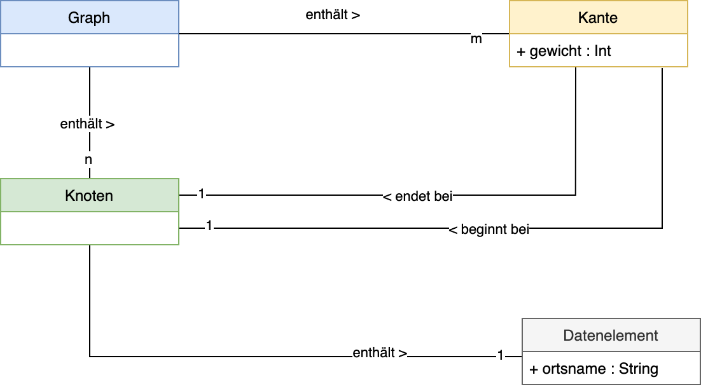
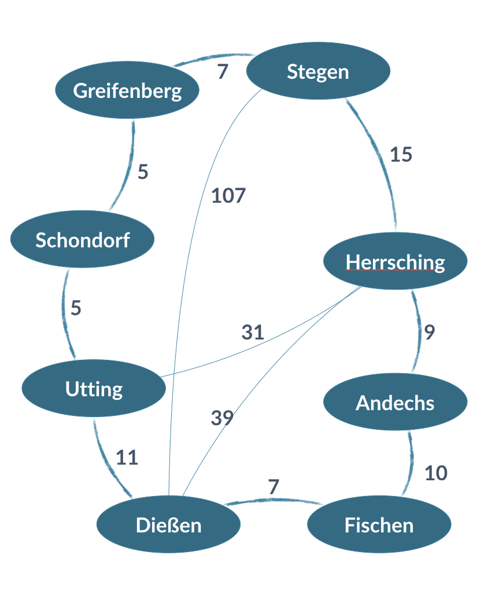

# 1. Graphen
## Aufgabe 1
Implementieren Sie einen VerweisGraph nach dem folgenden Klassendiagramm

## Aufgabe 2
Legen Sie anschließend den nachfolgenden Graphen in Ihrer Datenstruktur ab und überprüfen Sie die Korrektheit.

## Aufgabe 3
Schreiben Sie Methoden für die folgenden Funktionen der Klasse `Graph

1. `sucheKnoten(knoten : Knoten) : Boolean`
   Sucht eines Knoten (meldet, ob ein Knoten im Graph vorhanden ist)

2. `fun sucheKnoten(knoten : String) : Boolean`
   Sucht eines Knoten (meldet, ob ein Knoten im Graph vorhanden ist)

3. `fun gibNachbarnFuer(knoten : Knoten) : List<Knoten>`
   Suche von Nachbarn (meldet alle Nachbarn eines bestimmten Knotens)

4. `fun gibNachbarnFuer(knoten : String) : List<Knoten>`
   Suche von Nachbarn (meldet alle Nachbarn eines bestimmten Knotens)

6. `fun gibEntfernungZwischen(start : Knoten, ziel: Knoten) : Int`
   Berechnung der Entfernung (übernimmt 2 *direkt benachbarte* Knoten und gibt deren Entfernung aus).
   Soll `Int.MAX_VALUE` zurück geben, falls keine direkte Verbindung besteht